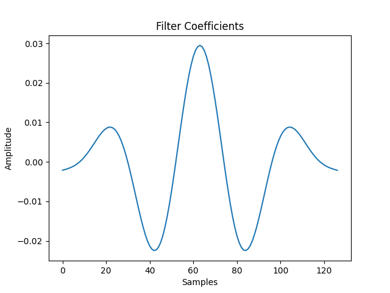
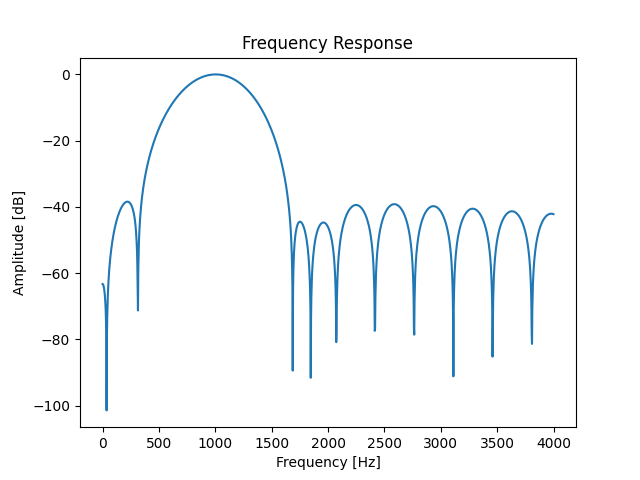
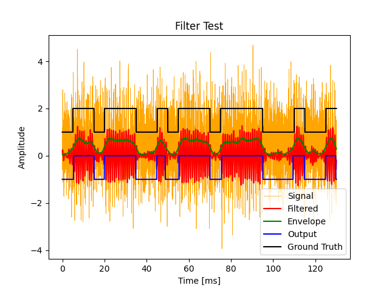

# Modem

Simple FSK modem implementation in Python.

## Usage

To generate a sound file, run the following command:

```
$ python src/audio-encoder.py
```

To decode a sound file, run the following command:

```
$ python src/audio-decoder.py
```

## Finite Impulse Response (FIR) Filter Test Results






